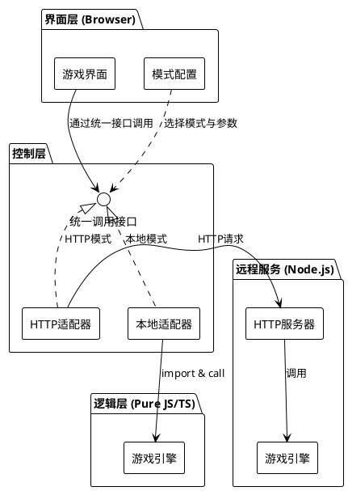

# 文字游戏三层架构技术实现文档

## 1. 概述
本方案为文字类型游戏定义一种三层软件架构，将系统划分为界面层、逻辑层和控制层。核心特点是逻辑层代码通过控制层提供**双模式调用**——同一套逻辑既可作为本地函数直接执行，也可封装为HTTP接口远程调用——从而支持单机运行与联网服务化两种形态，兼顾开发调试效率与部署灵活性。

## 2. 架构设计

### 2.1 分层模型与职责

```
┌──────────────────────────────────────┐
│           界面层（浏览器端）          │
│   • 游戏界面渲染与用户交互           │
│   • 支持切换调用模式（本地/远程）    │
└──────────────┬───────────────────────┘
               │ 调用统一控制层接口
┌──────────────▼───────────────────────┐
│              控制层                  │
│   • 本地模式：直接调用逻辑层函数     │
│   • HTTP模式：通过HTTP调用远程服务   │
│   • 对上层暴露一致的调用协议         │
└──────────────┬───────────────────────┘
               │ 统一接口协议
┌──────────────▼───────────────────────┐
│           逻辑层（纯JS/TS）          │
│   • 全部游戏业务规则与状态计算      │
│   • 无UI依赖，无网络依赖，可独立测试 │
└──────────────────────────────────────┘
```

**严格职责边界：**
- 界面层仅负责表现和交互，不包含任何游戏规则。
- 逻辑层为纯业务代码，不访问浏览器API或Node.js内置模块，所有外部依赖以参数形式注入。
- 控制层是适配层，封装逻辑层的调用细节，对上提供统一的、与调用方式无关的接口。

### 2.2 控制层双模式适配机制
控制层采用适配器模式，将逻辑层包装为两种可替换的调用通道：

```
               ┌──────────────────┐
               │    界面层配置     │
               │  mode: local/http│
               └────────┬─────────┘
                        │
            ┌───────────▼───────────┐
            │      统一调用入口      │
            │  （根据mode选择通道） │
            └───────────┬───────────┘
                        │
            ┌───────────┴───────────┐
            │                       │
       本地模式                  HTTP模式
            │                       │
    ┌───────▼───────┐     ┌─────────▼─────────┐
    │  逻辑层直接调用 │     │   HTTP 客户端      │
    │  (import)      │     │  (向远端发送请求)  │
    └───────────────┘     └─────────┬─────────┘
                                    │
                          ┌─────────▼─────────┐
                          │  Node.js 服务端    │
                          │  (包装逻辑层为API) │
                          └─────────┬─────────┘
                                    │
                          ┌─────────▼─────────┐
                          │      逻辑层        │
                          └───────────────────┘
```

- **本地模式**：控制层直接引用逻辑层模块，调用其函数并返回结果，无网络开销。
- **HTTP模式**：控制层根据配置的服务地址发起HTTP请求，由独立的Node.js服务端加载同一套逻辑层代码并提供RESTful风格接口；请求与响应均为JSON。

两种模式在界面层看来行为完全一致，切换仅需改变配置。

### 2.3 核心交互流程
1. 用户在界面层进行输入（如发送指令）。
2. 界面层调用控制层统一接口，传入动作描述。
3. 控制层依据当前模式：
   - 本地模式：直接调用逻辑层对应函数，返回结果。
   - HTTP模式：将动作序列化为HTTP请求，发送至远程服务器，获取响应后回传。
4. 界面层接收结果，更新显示内容。

## 3. 接口协议原则
- 界面层与控制层之间，以及控制层到逻辑层之间，均使用**结构化JSON**格式交互。
- 请求应携带动作类型与必要参数；响应应包含成功标志、叙述性内容、可选状态快照等。
- 具体字段由逻辑层定义，控制层仅负责透传，不改变语义。
- HTTP模式下，JSON即为请求/响应体；本地模式下，直接传递等价对象。

## 4. 关键约束与开发指引

### 4.1 逻辑层设计约束
- 零外部依赖：不可引入`window`、`document`、`fs`、`http`等任何平台特定API。
- 所有可能变化的行为（如随机数、时间）通过参数注入，确保纯函数化与可测试性。
- 状态管理：逻辑层输出新状态而不直接修改外部存储，由调用方决定如何持久化。

### 4.2 控制层设计约束
- 本地适配器与HTTP适配器必须实现完全相同的接口，保证互换性。
- HTTP服务端需加载与本地完全相同的逻辑层代码，杜绝逻辑分支。
- 服务端应设置CORS策略以允许浏览器调用。

### 4.3 推荐开发顺序
1. **逻辑层**  
   优先构建核心游戏引擎，编写完整单元测试，确保全部业务规则离线可验证。
2. **本地模式下验证玩法**  
   实现本地控制层适配器，用最小化界面将逻辑串联，快速迭代游戏内容。
3. **HTTP模式与服务端**  
   搭建Node.js服务端包装逻辑层，实现HTTP客户端适配器，支持远程调用。
4. **界面层完善**  
   构建完整游戏UI，集成统一控制层接口，加入模式切换与远端地址配置。

### 4.4 错误处理统一约定
- 逻辑层产生的错误，本地模式直接向上抛出；HTTP模式由服务端转换为统一的错误格式（如`{success: false, error: ...}`）。
- 界面层应统一捕获错误并以用户友好方式呈现。

## 5. PlantUML 架构配图



---

此文档定义了系统的宏观结构、各层职责与核心交互方式，避免过早锁定实现细节，可作为后续开发工作的统一参照。